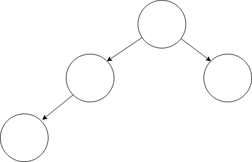

# Lab 1

## Processes

Processes are basically running programs. Read other literature for more info, such as _The Dinosaur Book_ or [OSTEP](http://pages.cs.wisc.edu/~remzi/OSTEP/).

## `fork()` System Call

The `fork()` system call (in UNIX-based systems) creates a new "child" process that is a duplicate of the one calling it, or the "parent". The same (logical) address space is used by the parent and the child process, though they reside in separate physical memory addresses. Code execution resumes from the line after the `fork()` call in both the child and parent processes. 

Multiple `fork()` calls do not behave as one expects. Each running process executes a call hence, each child creates its own child. The following image shows a process tree after two `fork()` calls.

## `wait()` System Call

The `wait()` system call, executed by a parent process, waits for all of its children to terminate before it resumes execution. The call has two other variants, `waitpid()` and `waitid()`. The former waits for a specific process to terminate, while the latter waits for a change in state of a specific process. Learn more about them by reading their man pages.

OSTEP has a [good reading](http://pages.cs.wisc.edu/~remzi/OSTEP/cpu-api.pdf) on these basic UNIX system calls.

## Assignment

1. Create a child process and observe the PID of the parent process when it is terminated before the child process. Use the `sleep()` and `exit()` calls where necessary.

2. Create a child process and use a `waitpid()` call to prevent the child from becoming an "orphan" as above.

3. Create a process tree by executing 3 `fork()` calls. Analyse the resulting tree and explain how it differs from the expected tree.